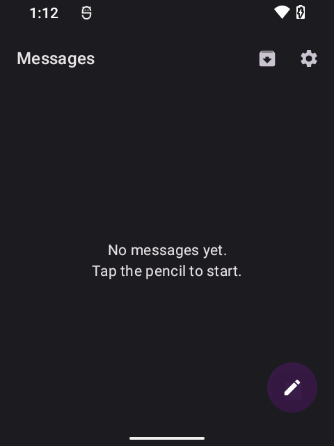
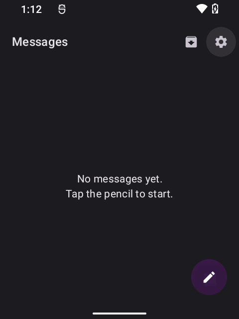
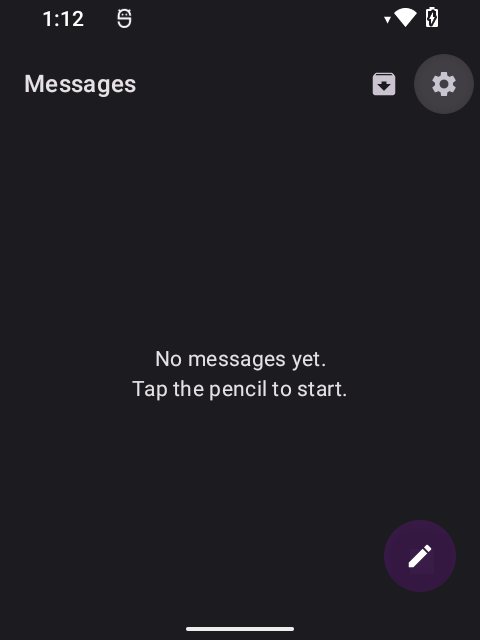
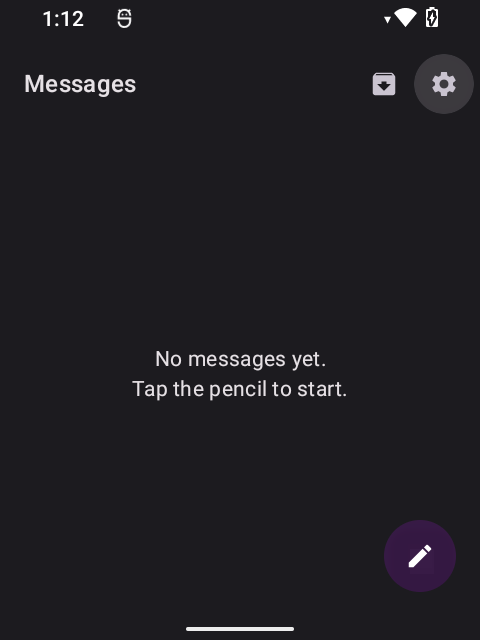
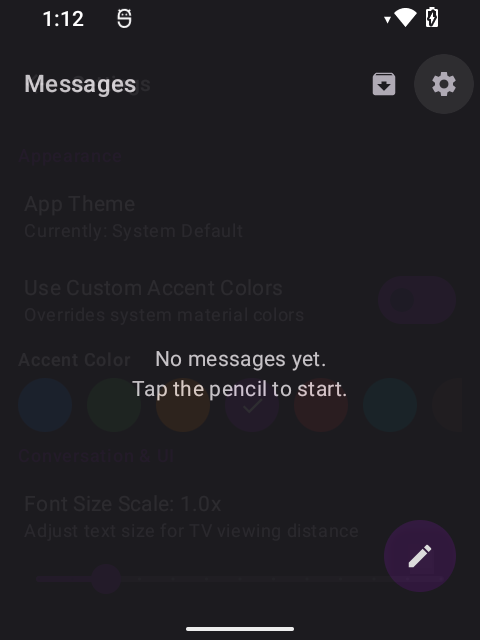
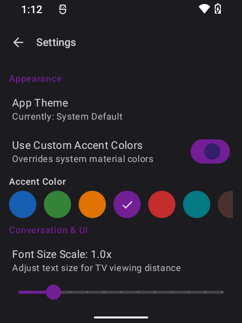

DPAD Messaging
===============

A minimal, D-pad-friendly SMS/MMS app built with Kotlin and Jetpack Compose. Optimized for low-RAM devices and hardware D-pad navigation (TVs, set-top boxes, and devices with directional pads).

Quick links
- Release (APK): https://github.com/jbriones95/DPAD-Messaging/releases/tag/v0.0.1

Highlights
- D-pad-first focus navigation with clear highlights
- SMS + MMS support (group messages, image attachments)
- Compact layouts for narrow viewports
- Thread metadata: pin, archive, mute, block (persisted locally)
- Configurable theme and accent color

Screenshots
- Main: 
- D-pad focus: 
- Thread options: 
- Chat view: 
- New message: 
- Settings: 

Getting started (developer)
1. Build debug APK: `./gradlew :app:assembleDebug`
2. Install debug APK: `adb install -r app/build/outputs/apk/debug/app-debug.apk`
3. Build release APK (signed): `./gradlew :app:assembleRelease` — result is `app/build/outputs/apk/release/app-release.apk` or `dpadsms.apk` attached to the release.
4. Run the app and grant runtime permissions. The app may prompt to be set as the default SMS app — accept to enable full functionality.

Notes
- This repository intentionally does not include signing credentials. Add `keystore.properties` at the repo root for release signing (see `app/build.gradle.kts`). Do NOT commit sensitive keys.
- MMS delivery behavior depends on carrier and device; test on real hardware.

Support
If you find this project useful, consider supporting development: https://buymeacoffee.com/jbriones95

License
This project is licensed under the MIT License — see LICENSE for details.
